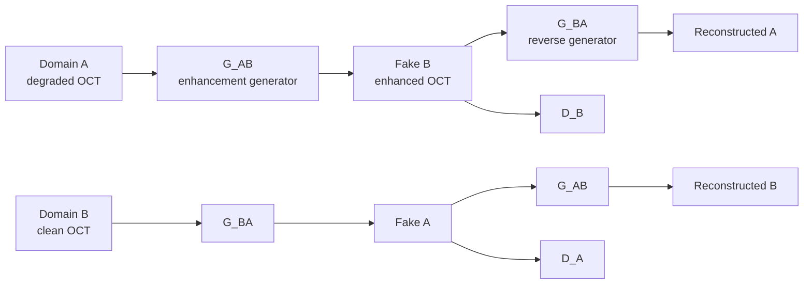
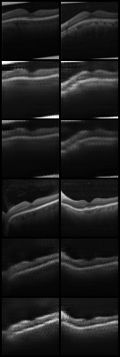
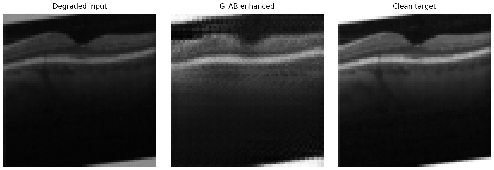
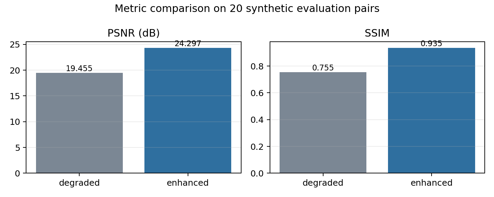
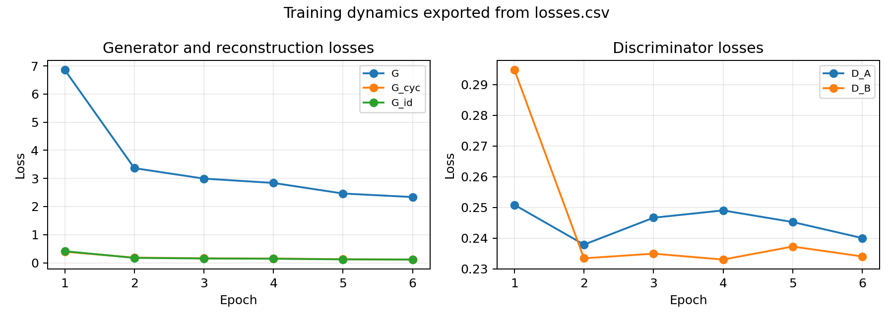

# Unsupervised Enhancement of Retinal OCT Images with CycleGAN and CBAM Attention

This repository studies an unsupervised image-to-image translation approach for retinal Optical Coherence Tomography (OCT) enhancement. The proposed pipeline builds two image domains from retinal OCT scans: a synthetically degraded domain and a clean reference domain. A CycleGAN model is then trained to learn the bidirectional mapping between these domains while preserving retinal morphology through cycle consistency.

The project is a research prototype. It focuses on reproducible methodology, interpretable training outputs, quantitative image-quality metrics, and a clear analysis of current limitations.

[Open the Colab notebook](https://colab.research.google.com/github/BLHmarwane/medical-gan-oct/blob/main/notebooks/train_colab.ipynb)

## 1. Objective

The objective is to learn a restoration function:

```text
G_AB: degraded OCT image -> enhanced OCT image
```

The expected result is an OCT image with reduced speckle/noise, improved contrast, and better visibility of retinal layers, while preserving the anatomical structure of the original scan.

The target output is not a clinical diagnosis. It is an image-enhancement step that could support downstream visual inspection, segmentation, or diagnostic-assistance pipelines after proper validation.

## 2. Motivation

OCT images often contain speckle noise, acquisition artifacts, low contrast, and blur. In clinical imaging, it is difficult to obtain perfectly paired examples of the same tissue acquired once under degraded conditions and once under ideal conditions.

CycleGAN is relevant because it can learn translations between two domains without requiring paired supervision. The model is constrained by cycle consistency: an image translated from domain A to domain B must be translatable back to its original domain.

CBAM attention is added to the ResNet generator to encourage the model to focus on informative feature channels and spatial regions. In OCT, this is important because the relevant morphology is not uniformly distributed across the image: retinal layers occupy structured bands, while noise and artifacts can appear across the full field.

## 3. Dataset Construction

The project uses the Kermany2018 retinal OCT dataset:

https://www.kaggle.com/datasets/paultimothymooney/kermany2018

The dataset is not included in the repository. It must be downloaded separately and placed under:

```text
data/raw/OCT2017/
```

The training domains are generated as follows:

```text
domain_B = original OCT images
domain_A = synthetically degraded versions of the same images
```

The synthetic degradation pipeline applies:

- speckle noise, to approximate OCT-specific multiplicative noise;
- Gaussian noise, to simulate sensor-level perturbation;
- Gaussian blur, to mimic loss of sharpness;
- contrast reduction, to reproduce low-quality acquisitions.

Although synthetic A_i/B_i pairs exist for evaluation, training uses CycleGAN-style unpaired sampling. This keeps the learning setup close to the practical case where paired degraded/clean medical images are scarce.

## 4. Method

The model contains two generators and two discriminators:

```text
G_AB: degraded -> clean-like
G_BA: clean-like -> degraded
D_A : discriminates real degraded images from generated degraded images
D_B : discriminates real clean images from generated clean-like images
```

The main restoration path is `G_AB`.



The training objective combines:

- adversarial loss: generated images must match the target-domain distribution;
- cycle-consistency loss: translated images must preserve source content;
- identity loss: images already in the target domain should not be unnecessarily modified;
- image replay buffer: discriminators are trained with a mixture of recent and older generated samples for stability.

## 5. Architecture

The generator follows a CycleGAN-style ResNet architecture with CBAM attention inside each residual block:

```text
Input 1x256x256
  -> reflection padding + 7x7 convolution
  -> two downsampling blocks
  -> nine ResNet + CBAM blocks
  -> two upsampling blocks
  -> reflection padding + 7x7 convolution
  -> tanh output in [-1, 1]
```

The discriminator is a 70x70 PatchGAN. Instead of classifying the whole image at once, it classifies local patches as real or fake. This is well suited to texture realism and local image quality, both important in OCT restoration.

## 6. Experimental Protocol

The short reproducible experiment is defined in:

```text
configs/cyclegan_cbam_demo.yaml
```

Run training:

```bash
python scripts/train.py --config configs/cyclegan_cbam_demo.yaml
```

Training exports:

```text
checkpoints/demo/latest.pt       latest model state
checkpoints/demo/losses.csv      epoch-level training losses
logs/demo_samples/epoch_*.png    visual CycleGAN sample grids
```

Run quantitative evaluation:

```bash
python scripts/evaluate.py \
  --config configs/cyclegan_cbam_demo.yaml \
  --checkpoint checkpoints/demo/latest.pt \
  --limit 100 \
  --output logs/evaluation/demo_metrics.csv
```

Run inference on one image:

```bash
python scripts/infer.py \
  --config configs/cyclegan_cbam_demo.yaml \
  --checkpoint checkpoints/demo/latest.pt \
  --image data/processed/domain_A/A_0.png \
  --clean data/processed/domain_B/B_0.png \
  --output logs/inference/demo_panel.png
```

## 7. Reading the Visual Results

The CycleGAN sample grid contains six rows:

```text
1. real A      degraded OCT input
2. fake B      G_AB(A), enhanced output
3. rec A       G_BA(G_AB(A)), cycle reconstruction
4. real B      clean OCT reference-domain image
5. fake A      G_BA(B), generated degraded image
6. rec B       G_AB(G_BA(B)), cycle reconstruction
```



The primary qualitative comparison is row 1 versus row 2. A successful enhancement should reduce noise and improve layer visibility without removing retinal structures. Rows 3 and 6 are used to verify cycle consistency: reconstructed images should remain close to their inputs.

The inference panel shows the practical use case of the trained `G_AB` generator:



## 8. Quantitative Metrics

Evaluation uses the synthetic pairing created during degradation:

```text
baseline: degraded A_i vs clean B_i
model:    G_AB(A_i) vs clean B_i
```

Two image-quality metrics are reported:

- **PSNR**: measures pixel-level reconstruction fidelity. Higher is better. It is sensitive to intensity differences but does not fully capture perceptual quality.
- **SSIM**: measures structural similarity. Higher is better. It is more relevant than PSNR for preserving retinal layer structure, but it still remains an image-quality metric, not a clinical endpoint.

Example metric export from a short local reproducibility run:

| Comparison | PSNR (dB) | SSIM |
|---|---:|---:|
| Degraded input vs clean target | 19.455 | 0.755 |
| Enhanced output vs clean target | 24.297 | 0.935 |



The important interpretation is not only whether the metric improves, but whether the visual output remains anatomically plausible. In medical imaging, a numerically improved image is not sufficient if the model hallucinates, removes, or distorts clinically relevant structures.

## 9. Training Dynamics

`scripts/train.py` exports epoch-level losses to `losses.csv`. The main curves to inspect are:

- `G`: total generator objective;
- `G_cyc`: cycle-consistency term, expected to decrease as anatomical reconstruction improves;
- `G_id`: identity preservation term;
- `D_A`, `D_B`: discriminator losses, which should not collapse to zero for long periods.



GAN training is inherently oscillatory. A useful run is therefore judged by both loss evolution and image samples. Stable losses with visually degraded outputs are not sufficient; visually clean outputs with poor cycle reconstruction are also suspicious.

## 10. Current Interpretation

The implemented pipeline demonstrates that:

- the OCT degradation strategy produces controlled source and target domains;
- the CycleGAN+CBAM architecture can be trained end to end;
- the training loop saves checkpoints, sample grids, and loss curves;
- the evaluation script can compare degraded and enhanced images against clean synthetic references;
- the inference script provides a direct visual output for individual scans.

The current results should be interpreted as exploratory. A short demo run validates the workflow and produces preliminary visual and quantitative outputs, but it is not enough to claim clinical robustness or generalization.

## 11. Limitations

The main limitations are:

- synthetic degradation may not perfectly reproduce real OCT acquisition artifacts;
- the current demo subset is small relative to the full Kermany dataset;
- PSNR and SSIM do not measure clinical usefulness directly;
- CycleGAN can hallucinate plausible texture if not carefully validated;
- no completed CBAM ablation is claimed yet;
- no external validation set from another OCT source is included.

These limitations are important because medical image enhancement must preserve diagnostic content. A restoration model should improve readability without changing pathology-relevant morphology.

## 12. Future Work

Planned improvements:

- train longer on GPU using a larger subset or the full Kermany dataset;
- run the no-CBAM ablation from `configs/cyclegan_no_cbam_demo.yaml`;
- compare against simpler baselines such as classical denoising, U-Net restoration, or supervised paired training on synthetic data;
- add perceptual or structure-aware losses while monitoring hallucination risk;
- evaluate on held-out disease classes and potentially external OCT data;
- add uncertainty or residual maps to highlight where the model modified the image;
- involve clinical review for anatomical plausibility and diagnostic preservation.

## 13. Repository Structure

```text
configs/          YAML experiment configurations
docs/             project handbook and report assets
notebooks/        Colab training notebook
scripts/          training, evaluation, inference entry points
src/data/         dataset and synthetic degradation
src/models/       generator, discriminator, CBAM
src/losses/       CycleGAN losses
src/training/     trainer and replay buffer
src/utils/        visualization helpers
```

## 14. Reproducibility Notes

The repository intentionally excludes:

```text
data/
checkpoints/
logs/
```

This keeps the repository lightweight and avoids redistributing datasets or generated model artifacts. The Colab notebook and scripts regenerate these outputs from the downloaded dataset.

## Author

Marwane BELHAMRA

Biomedical engineer - computer vision and medical image processing
